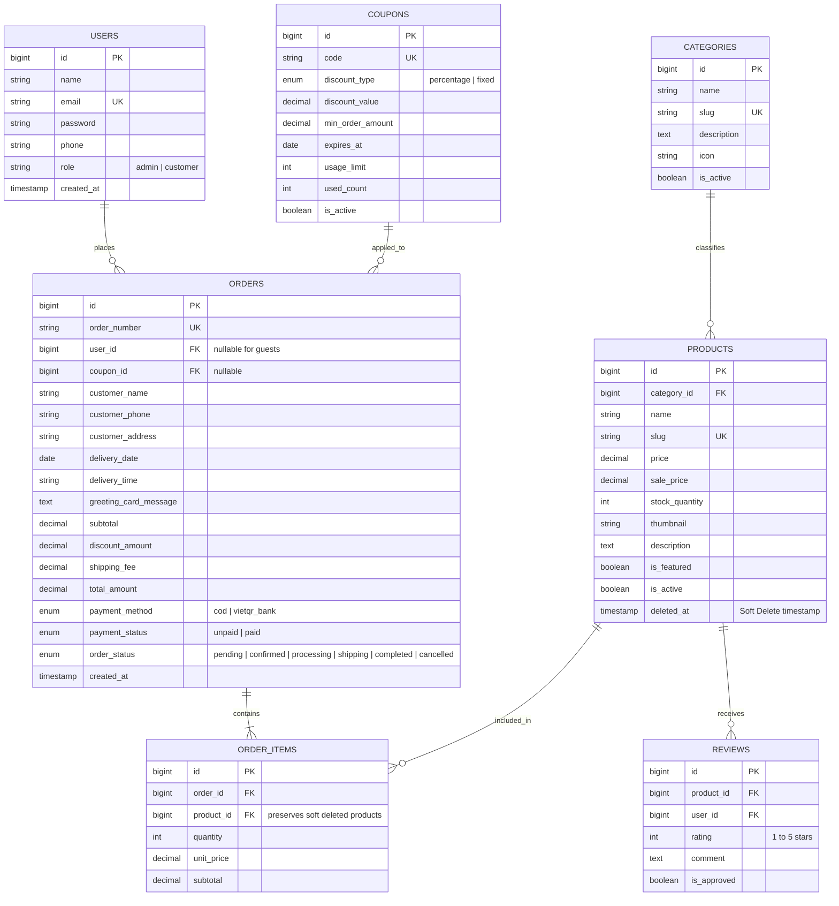
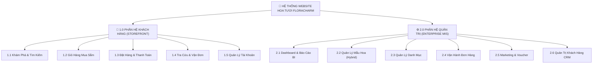
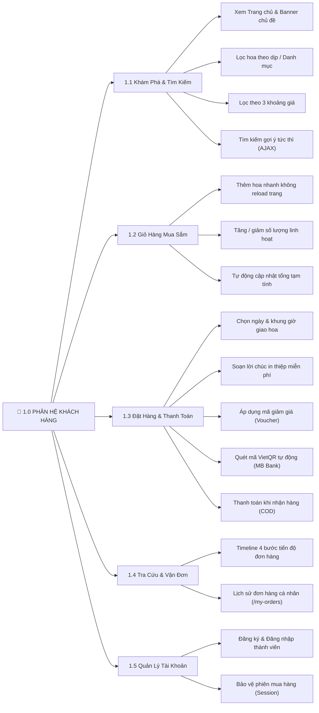
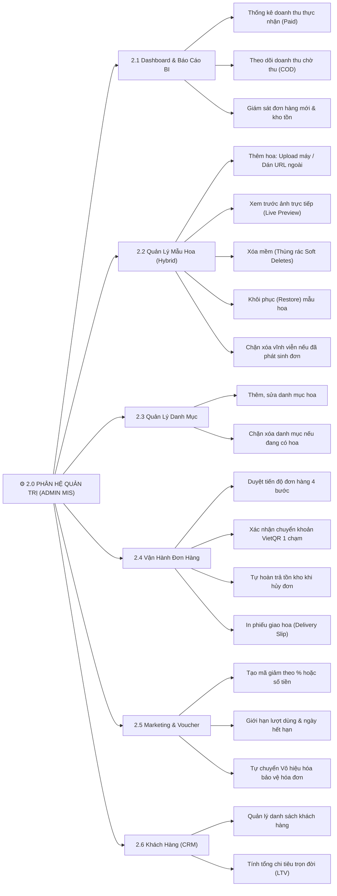
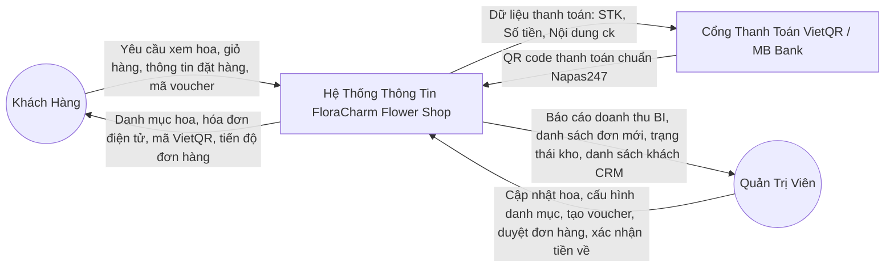
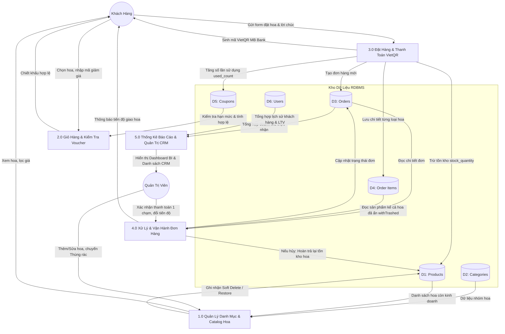

# Demo Phân Tích Hệ Thống Thông Tin & Toàn Vẹn Dữ Liệu
## Dự Án: Hệ Thống Thương Mại Điện Tử & Quản Trị Cửa Hàng Hoa Tươi (FloraCharm MIS)
- **Vị trí dự án:** `D:\01_HocTap_CNTT\01_Website_Cua_hang_ban_hoa`
- **Công nghệ nền tảng:** Laravel 10/12 (PHP 8.2), MySQL 8.0, Blade, Bootstrap 5.3, VietQR Banking API
- **Tiêu chuẩn thiết kế:** Enterprise Information Systems (MIS), Referential Integrity (Toàn vẹn tham chiếu), Soft Deletes Pattern, Audit Trail (Vết kiểm toán).

---

## 1. GIẢI QUYẾT BÀI TOÁN TOÀN VẸN DỮ LIỆU: TẠI SAO PHẢI DÙNG SOFT DELETES?

### 1.1. Hiểm Họa Nghiêm Trọng Của Hard Delete (Xóa Cứng Truyền Thống)
Trong mô hình bán hàng thực tế:
1. **Phá vỡ Toàn vẹn tham chiếu (Referential Integrity):** Bảng `order_items` lưu `product_id` trỏ đến `products.id`. Nếu Admin xóa vĩnh viễn mẫu hoa trong CSDL:
   - MySQL sẽ chặn lại với lỗi `Integrity constraint violation (1451)` nếu có foreign key.
   - Nếu dùng `CASCADE` hoặc `SET NULL`: Toàn bộ các đơn hàng trong quá khứ của khách hàng sẽ mất trắng tên hoa, ảnh hoa hoặc bị xóa lây toàn bộ đơn hàng!
2. **Thất thoát Báo cáo Tài chính & Kế toán:** Doanh thu tháng trước đã hạch toán dựa trên mặt hàng đó. Xóa cứng làm sai lệch toàn bộ số liệu kế toán và lịch sử kinh doanh.
3. **Crash giao diện người dùng:** Khi khách hàng vào tra cứu lịch sử mua hàng (`/my-orders` hoặc `/track-order`), việc gọi `$item->product->name` sẽ quăng lỗi `Attempt to read property on null` (HTTP 500 Fatal Error).

### 1.2. Kiến Trúc Toàn Vẹn Doanh Nghiệp Đã Triển Khai
Hệ thống đã được nâng cấp toàn diện theo chuẩn MIS:
* **Bổ sung migration SoftDeletes:** Thêm cột `deleted_at` vào bảng `products`.
* **Cơ chế Ẩn An Toàn (Soft Delete):** Khi Admin xóa hoa, trường `deleted_at` được gán timestamp. Hoa biến mất ngay lập tức khỏi Storefront để khách không mua được nữa, nhưng bản ghi trong CSDL vẫn tồn tại.
* **Quan hệ Lịch sử Đơn Hàng:** Trong model `OrderItem`:
  ```php
  public function product()
  {
      return $this->belongsTo(Product::class)->withTrashed();
  }
  ```
  Nhờ `->withTrashed()`, mọi đơn hàng lịch sử của khách và hóa đơn bán lẻ vẫn hiển thị đầy đủ tên, ảnh, số lượng, giá bán kể cả khi hoa đã bị xóa mềm!
* **Phân tách 2 chế độ quản trị:**
  - **Tab Đang kinh doanh:** Xem, tìm kiếm, chỉnh sửa, đưa vào Thùng rác.
  - **Tab Thùng rác (Xóa mềm):** Hiển thị danh sách hoa đã xóa kèm ngày giờ xóa, nút **Khôi phục (Restore)** để tiếp tục kinh doanh, và nút **Xóa vĩnh viễn (Force Delete)**.
* **Cơ chế Business Guard (Chặn xóa vĩnh viễn nếu đã phát sinh đơn):**
  - Trong `AdminProductController@forceDelete`: Hệ thống kiểm tra `$product->order_items_count`. Nếu `> 0`, hệ thống **CHẶN TUYỆT ĐỐI** và thông báo từ chối để bảo toàn tính toàn vẹn tài chính. Chỉ cho phép xóa vĩnh viễn hoa mẫu tạo thử nghiệm chưa từng có giao dịch.
## 2. CƠ CẤU 6 PHÂN HỆ QUẢN TRỊ DOANH NGHIỆP (ENTERPRISE MIS)

1. **Phân Hệ Dashboard & Business Intelligence (BI):**
   * Doanh thu thực tế chuẩn kiểm toán: Chỉ tính các đơn hàng đã thanh toán (`payment_status = 'paid'`).
   * Theo dõi doanh thu treo (COD chưa thu tiền).
   * Thống kê tổng số đơn, đơn chờ duyệt, tổng mẫu hoa đang bày bán.
2. **Phân Hệ Quản Lý Mẫu Hoa & Tồn Kho (Products & Inventory):**
   * Danh sách hoa có bộ lọc danh mục và ô tìm kiếm theo từ khóa.
   * Chế độ tab: Đang kinh doanh vs Thùng rác (Xóa mềm).
   * **Cơ chế tải ảnh Hybrid 2-trong-1 (Enterprise Image Architecture):**
     - Cho phép **Tải trực tiếp tệp ảnh từ máy tính/điện thoại** (JPG, PNG, WEBP tối đa 2MB, lưu trữ tại `storage/app/public/products` qua symlink `public/storage`).
     - Cho phép **Dán đường dẫn link ảnh URL** trực tiếp từ CDN ngoài (Unsplash, Pexels) để linh hoạt demo.
     - **Xem trước ảnh trực tiếp (Live Image Preview):** Tự động render khung ảnh xem trước ngay khi vừa chọn tệp hoặc vừa nhập URL nhờ Javascript FileReader API.
     - **Tự động dọn rác ổ đĩa (Storage Cleanup):** Tự động xóa file ảnh cũ khi Admin cập nhật ảnh mới, chống phình dung lượng server.
     - **Nhận diện thông minh (Smart Accessor):** Model `Product.php` tự động phân biệt link ngoài (`http/https`) và đường dẫn nội bộ (`storage/products/...`) để trả về URL chuẩn xác cho Storefront.
   * Khôi phục (Restore) hoa bị xóa mềm; Chặn xóa vĩnh viễn (Force Delete Guard) nếu đã từng có đơn hàng.
3. **Phân Hệ Quản Lý Danh Mục (Category Subsystem):**
   * Quản lý nhóm hoa (Sinh nhật, Khai trương, Tình yêu, Chia buồn, Lan hồ điệp...).
   * Hiển thị số lượng hoa trực thuộc.
   * Toàn vẹn dữ liệu: Chặn xóa danh mục nếu đang có hoa trực thuộc (`category->products_count > 0`).
4. **Phân Hệ Quản Lý Đơn Hàng & Vận Hành (Order Fulfillment):**
   * Lọc đơn theo trạng thái (chờ duyệt, đang cắm hoa, đang giao, giao thành công, đã hủy).
   * **Nút xác nhận thanh toán VietQR 1 chạm (`quickMarkPaid`):** Cập nhật ngay khi kế toán thấy tiền vào app ngân hàng MB Bank.
   * **Hoàn trả tồn kho tự động:** Khi đơn hàng bị hủy, toàn bộ số lượng hoa trong đơn tự động cộng trả lại vào kho.
   * In phiếu giao hoa (Print Delivery Slip) kèm lời chúc in thiệp.
5. **Phân Hệ Quản Lý Khuyến Mãi / Voucher (Marketing & Coupons):**
   * Tạo voucher giảm giá theo % hoặc theo tiền mặt (Đã tạo mã `GIAM99` giảm 99% cho khách test).
   * Quy định ngày hết hạn, giá trị đơn tối thiểu, giới hạn số lần áp dụng.
   * Bảo toàn dữ liệu: Chặn xóa cứng voucher đã có đơn hàng sử dụng (tự động chuyển sang trạng thái Vô hiệu hóa).
6. **Phân Hệ Quản Trị Khách Hàng (Customer CRM):**
   * Theo dõi danh sách tài khoản khách hàng, tìm kiếm theo tên, email, số điện thoại.
   * Thống kê số lượng đơn hàng khách đã mua và tổng giá trị chi tiêu trọn đời (Customer Lifetime Value - LTV).

---

## 3. SƠ ĐỒ THỰC THỂ QUAN HỆ (ERD - ENTITY RELATIONSHIP DIAGRAM)



---

## 4. SƠ ĐỒ PHÂN RÃ CHỨC NĂNG (BFD - BUSINESS FUNCTION DECOMPOSITION)

### 4.1. Sơ Đồ Cây Tổng Thể (High-Level BFD)
*Sơ đồ thể hiện cấu trúc 2 phân hệ cốt lõi và 11 nhóm chức năng chính của hệ thống FloraCharm:*



---

### 4.2. Sơ Đồ Chi Tiết Phân Hệ Khách Hàng (Storefront BFD)



---

### 4.3. Sơ Đồ Chi Tiết Phân Hệ Quản Trị (Admin MIS BFD)



---

### 4.4. Bảng Ma Trận Cây Chức Năng Hệ Thống (Hierarchical Functional Matrix)

| Mã CN | Tên Chức Năng Cấp 2 | Nhóm Chức Năng Con (Cấp 3) | Tác Nhân Thực Hiện | Mục Đích Nghiệp Vụ |
| :--- | :--- | :--- | :--- | :--- |
| **F1.1** | Khám phá & Catalog | Trang chủ, Danh mục, Lọc giá, Tìm kiếm AJAX | Khách hàng | Giúp khách tìm kiếm mẫu hoa ưng ý nhanh nhất |
| **F1.2** | Giỏ hàng mua sắm | Thêm AJAX, đổi số lượng, xóa hoa, tính tiền | Khách hàng | Lưu giữ các sản phẩm chọn mua trong phiên làm việc |
| **F1.3** | Đặt hàng & Thanh toán | Chọn giờ giao, in thiệp, áp voucher, VietQR, COD | Khách hàng | Hoàn tất giao dịch mua hoa với đặc thù quà tặng |
| **F1.4** | Tra cứu & Vận đơn | Timeline 4 bước vận đơn, lịch sử mua hàng | Khách hàng | Theo dõi đơn hàng minh bạch, gia tăng trải nghiệm |
| **F1.5** | Xác thực người dùng | Đăng ký, đăng nhập, bảo vệ session | Khách hàng | Quản lý định danh tài khoản khách hàng |
| **F2.1** | Dashboard & BI | Báo cáo doanh thu thực, đơn mới, cảnh báo kho | Quản trị viên | Cung cấp cái nhìn toàn cảnh về tình hình kinh doanh |
| **F2.2** | Quản lý hoa (Hybrid) | Thêm, sửa, tải ảnh từ máy, xóa mềm, khôi phục | Quản trị viên | Quản trị catalog, bảo toàn lịch sử bán hàng |
| **F2.3** | Quản lý danh mục | Thêm, sửa, ràng buộc toàn vẹn cha-con | Quản trị viên | Phân loại hoa theo dịp và bảo vệ liên kết CSDL |
| **F2.4** | Vận hành đơn hàng | Cập nhật tiến độ, xác nhận VietQR 1 chạm, hoàn kho | Quản trị viên | Xử lý cắm hoa, giao hoa và điều phối tài chính |
| **F2.5** | Marketing & Voucher | Tạo voucher %, tiền mặt, vô hiệu hóa an toàn | Quản trị viên | Kích cầu mua sắm và quản lý ngân sách khuyến mãi |
| **F2.6** | Quản trị CRM | Danh sách khách, thống kê tổng chi tiêu LTV | Quản trị viên | Chăm sóc khách hàng trung thành, phân nhóm khách |

---

## 5. SƠ ĐỒ LUỒNG DỮ LIỆU (DFD - DATA FLOW DIAGRAM)

### 5.1. DFD Mức Ngữ Cảnh (Context Diagram - Level 0)


### 5.2. DFD Mức Đỉnh (Level 1 DFD)


---

## 6. HỆ THỐNG BACKEND & CSDL (LARAVEL ELOQUENT)
* **13 Controllers & Middleware:**
  * Khách hàng: `HomeController`, `FlowerController`, `CartController`, `CheckoutController`, `OrderTrackingController`, `AuthController`.
  * Quản trị viên: `AdminDashboardController`, `AdminProductController`, `AdminCategoryController`, `AdminOrderController`, `AdminCouponController`, `AdminUserController`.
  * Bảo mật: `AdminMiddleware` (bảo vệ khu vực `/admin`, trả về HTTP 403 Forbidden).
* **8 Database Migrations & 7 Eloquent Models:**
  * `User`, `Category`, `Product` (SoftDeletes), `Coupon`, `Order`, `OrderItem` (withTrashed relation), `Review`.
* **Database Seeders Mẫu:**
  * `UserSeeder`: Tài khoản Admin (`admin@flowershop.vn` / `admin123`) và Khách hàng test.
  * `CategorySeeder`: 6 danh mục hoa chính.
  * `ProductSeeder`: 12+ mẫu hoa tươi kèm ảnh đẹp.
  * `CouponSeeder`: Voucher giảm 99% (`GIAM99`, `FLORA99`) và voucher chào mừng 10%.
* **Routing:**
  * `routes/web.php`: 24 routes chuyên biệt cho quản trị viên và 12 routes cho khách hàng.

* **Môi trường kép (Dual-Mode):** `Dockerfile` + `docker-compose.yml` (App + MySQL 8.0 + phpMyAdmin) kết hợp hỗ trợ Laragon/XAMPP cục bộ.
* **Tài liệu chuẩn:**
  * `CONTRIBUTING.md`: 6 luật Git bất di bất dịch, mô hình Git Flow.
  * `docs/WORK_LOG.md`: Mẫu nhật ký hoạt động 4 tuần theo mã PR.
  * `docs/API_SPECIFICATION.md`: Đặc tả 5 RESTful API nội bộ.
  * Mẫu `.github/pull_request_template.md` và `.github/ISSUE_TEMPLATE/feature_task.md`.
* **ECC Framework:** Đã tích hợp bộ công tắc quy chuẩn code, TDD và bảo mật trong `.agents/` trỏ chính xác về thư mục ổ D:.

---

## 7. KIẾN TRÚC XỬ LÝ ẢNH HYBRID (HYBRID IMAGE ARCHITECTURE & OPTIMIZATION)

Nhằm khắc phục triệt để các hạn chế của việc chỉ dùng link URL bên ngoài (nguy cơ link die, lỗi bảo mật mixed content, không thân thiện với nhân viên bán hàng), hệ thống đã được nâng cấp lên **Kiến Trúc Ảnh Hybrid 2-trong-1**:

1. **Phương Thức Nhập Đa Dạng (Flexible Ingestion):**
   * **Chế độ Tải File (Local File Upload):** Cho phép kéo thả hoặc chọn file ảnh trực tiếp từ thiết bị (hỗ trợ JPG, JPEG, PNG, WEBP, tối đa 2MB). Ảnh được hash tên ngẫu nhiên chống trùng lặp và lưu trữ bảo mật tại `storage/app/public/products`.
   * **Chế độ Link Ngoài (External CDN URL):** Vẫn giữ tùy chọn dán link URL từ các nền tảng ảnh mẫu (Unsplash, Pexels, CDN) phục vụ cho nhu cầu seeding và demo nhanh chóng.
2. **Trải Nghiệm Quản Trị Trực Quan (Live Image Preview):**
   * Tích hợp Javascript FileReader API trên form Thêm (`create.blade.php`) và Sửa (`edit.blade.php`). Ngay khi người dùng chọn file hoặc dán URL, khung ảnh xem trước kích thước `110x110` lập tức cập nhật để nhân viên kiểm tra thẩm mỹ trước khi submit form.
3. **Bảo Trì Bộ Nhớ Tự Động (Garbage Collection & Storage Cleanup):**
   * Trong `AdminProductController@update`: Khi Admin tải ảnh mới hoặc chuyển sang URL khác, hệ thống tự động kiểm tra xem ảnh cũ có phải file lưu cục bộ không. Nếu có, Laravel tự động gọi `Storage::disk('public')->delete()` để xóa tệp cũ, ngăn ngừa hoàn toàn tình trạng "file rác" làm phình dung lượng server.
4. **Bộ Phân Giải Đường Dẫn Đa Năng (Smart Model Accessor):**
   * Model `Product.php` trang bị phương thức `getPrimaryImageAttribute()` thông minh:
     - Nếu trường `thumbnail` rỗng: Trả về ảnh mặc định fallback.
     - Nếu `thumbnail` chứa tiền tố `http://` hoặc `https://`: Trả về trực tiếp URL ngoài.
     - Nếu `thumbnail` là đường dẫn nội bộ: Tự động bọc qua helper `asset('storage/' . $this->thumbnail)` để sinh URL hợp lệ cho Storefront và Admin portal.

---

## 8. KẾT QUẢ KIỂM THỬ MÃ NGUỒN & HẠ TẦNG RUNTIME

```text
1. Runtime Skeleton & Composer:
   - Laravel Framework 12.69.2 (PHP 8.2.4 CLI) - Khắc phục 100% cảnh báo bảo mật PKSA của Laravel 10.
   - artisan CLI, bootstrap/app.php, config/, public/index.php, storage/ đã nạp đầy đủ.
   - APP_KEY đã được tạo tự động trong .env.
2. Cú pháp PHP Lint:
   - 10 Controllers & Middleware: 100% Passed (0 syntax errors)
   - 7 Eloquent Models: 100% Passed (0 syntax errors)
   - 7 Migrations: 100% Passed (0 syntax errors)
   - 4 Seeders: 100% Passed (0 syntax errors)
3. Kiểm thử Database Migration & Seeding:
   - 7/7 Bảng CSDL (users, categories, products, coupons, orders, order_items, reviews) khởi tạo thành công.
   - 3 Seeders chạy thành công: Tạo tài khoản Admin (admin@flowershop.vn / admin123), 6 danh mục hoa, 12+ sản phẩm hoa mẫu.
4. Trạng thái Git:
   - Nhánh 'develop' và 'main' đồng bộ, working tree sạch hoàn toàn (clean).
```

---

## 9. HƯỚNG DẪN KHỞI CHẠY DỰ ÁN TRÊN Ổ D:

Toàn bộ mã nguồn, thư viện `vendor/` và file thực thi `artisan` đã sẵn sàng 100% tại `D:\01_HocTap_CNTT\01_Website_Cua_hang_ban_hoa`. Bạn không cần chạy `composer install` hay `php artisan key:generate` nữa!

### Các bước khởi chạy bằng Laragon (Khuyến nghị cho nhóm môn học):
1. **Bật MySQL:** Mở **Laragon** (hoặc XAMPP) và bấm **Start All** (để khởi động dịch vụ MySQL).
2. **Tạo Database:** 
   - Bấm nút **Database** trên giao diện Laragon (hoặc mở trình duyệt vào `http://localhost/phpmyadmin`).
   - Tạo một Database mới có tên: `flower_shop` (Collation: `utf8mb4_unicode_ci`).
3. **Chạy Migration & Nạp dữ liệu mẫu:**
   Mở terminal PowerShell tại `D:\01_HocTap_CNTT\01_Website_Cua_hang_ban_hoa` và chạy:
   ```bash
   php artisan migrate --seed
   ```
4. **Khởi động Website:**
   ```bash
   php artisan serve
   ```
5. **Trải nghiệm ứng dụng:**
   - **Giao diện Khách hàng:** Truy cập [http://127.0.0.1:8000](http://127.0.0.1:8000)
     - Xem danh mục hoa, giỏ hàng, lọc sản phẩm.
     - Đặt thử đơn hàng với chọn ngày/giờ giao hoa, lời chúc in thiệp, quét mã VietQR tự động.
     - Tra cứu tiến độ đơn hàng tại menu **Tra cứu đơn**.
   - **Giao diện Quản trị viên (Admin Portal):** Truy cập [http://127.0.0.1:8000/login](http://127.0.0.1:8000/login)
     - Email: `admin@flowershop.vn`
     - Mật khẩu: `admin123`
     - Quản lý doanh thu, duyệt đơn hàng hoa, cập nhật trạng thái tiến độ giao, in phiếu giao hoa.
